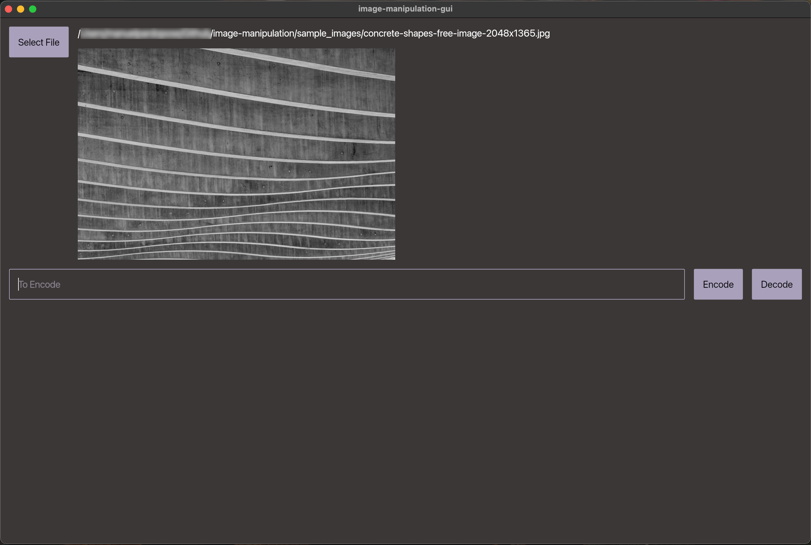

# image-manipulation

## Current Features
- Encode data into an image without the information being visually noticable. You can also pass in a key for simple encryption.
- CLI and GUI available

## GUI


## Installation
`cargo install --git https://github.com/ManuelPardoPose/image-manipulation.git`

## `image-manipulation -h`
```
Can Encode/Decode Data into Images

Usage: image-manipulation [COMMAND]

Commands:
  encode  Encodes data into an image
  decode  Decodes data from an image
  gui     Open GUI
  help    Print this message or the help of the given subcommand(s)

Options:
  -h, --help     Print help
  -V, --version  Print version
```

## Todo
- optional better obfuscation with some funky offsets will be added in the future
- add other image-manipulation stuff
